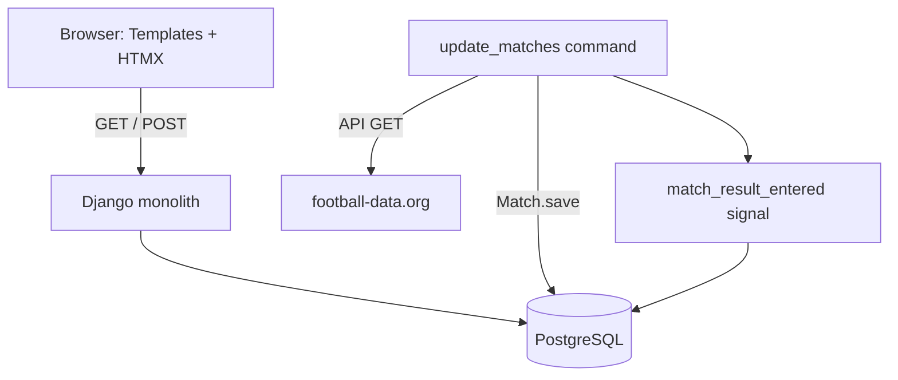
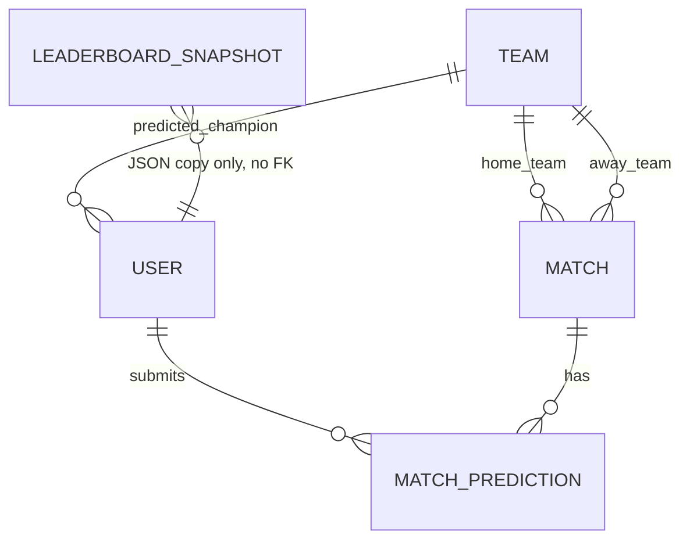
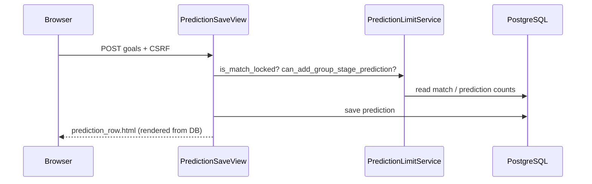

# System Architecture

> Verified reference document. Every claim below was checked against this repository's
> source code (models, views, urls, signals, templates, settings, management commands)
> on 2026-09-16. File paths are exact.

## 1. One-sentence summary

`django-tipapp` is a private World Cup 2026 tipping game: logged-in users predict match
scores, use a limited number of jokers, pick a champion, and compare points on a
leaderboard. Django renders pages server-side; HTMX refreshes small HTML fragments
without full page reloads.

## 2. What the app currently offers

- Login, logout, password reset (Django auth views)
- Per-user settings: username, email, theme, champion pick
- Chronological match list with client-side phase filtering
- Up to 36 group-stage predictions, jokers in knockout rounds with phase-dependent limits
- Autosave of predictions, a dedicated "all predictions for this match" page
- Live-ish updates of match rows and leaderboard via HTMX polling
- Automatic result import from football-data.org
- Automatic scoring and Olympic-style ranking
- Django admin, staff-only CSV leaderboard export

Not yet implemented (present only as product-boundary goals in
[.github/copilot-instructions.md](../../.github/copilot-instructions.md)):
- A forum/discussion feature for tippers
- The `notifications` app: the directory exists
  ([notifications/](../../notifications/)) with `migrations/`, `management/`, `tests/`
  subfolders, but there is no `models.py` or `apps.py`, and it is **not** listed in
  `INSTALLED_APPS` ([tipapp/settings/base.py](../../tipapp/settings/base.py)). Treat it
  as inactive scaffolding, not a working app.

## 3. Mental model

Three independent flows:

1. **Browser ↔ Django.** Loads pages, saves predictions, polls for HTML fragments.
2. **Background process ↔ football-data.org.** `update_matches` management command
   fetches scores and writes them to PostgreSQL.
3. **Signal-driven scoring.** A changed match result triggers scoring and ranking
   recalculation.



The browser's HTMX polling never calls football-data.org directly — it only reads the
current state from PostgreSQL via Django views.

## 4. Why this architecture

| Decision | Why it fits here |
|---|---|
| Django monolith | Low operational overhead for a hobby-scale app (~50-100 users) |
| PostgreSQL | Relational model fits users/matches/predictions/teams naturally |
| Django templates | No separate frontend project, no duplicated API/UI logic |
| HTMX | Interactive UI without a JS framework or bespoke JSON API |
| Tailwind via CDN | `templates/base.html` loads `cdn.tailwindcss.com` directly; `static/` is empty — there is no production Tailwind build step today |
| Separate management command for sync | API calls don't block web request/response cycle |
| Django signals (`match_result_entered`) | Small, event-based coupling between `matches` and `scoring` (see [docs/project/decisions.md](decisions.md)) |
| Cached `total_points` / `global_rank` on `User` | Leaderboard reads become cheap; see the 2026-08-24 decision in [decisions.md](decisions.md) |

This is a reasonable fit for the current scale. WebSockets, Celery, Redis, or a
microservice split are not warranted without a measured, concrete bottleneck (also see
`.github/copilot-instructions.md`, which explicitly disallows introducing them without an
OpenSpec-documented reason).

## 5. Module breakdown

```text
tipapp/         Project root: URLs, settings, HomeView, RankingUpdatesView
core/           Shared ranking algorithm (Olympic-style tie handling)
users/          Custom User model, settings/rules views, forms
matches/        Team/Match models, football-data.org client, sync command, signals
predictions/    MatchPrediction model, limit/lock service, HTMX views, forms
scoring/        Scoring formulas, champion bonus, ranking service, signals, CSV export
notifications/  Scaffolding only — not registered in INSTALLED_APPS, no models yet
templates/      Full pages + reusable partials (predictions row is shared between pages)
```

The split follows domain boundaries, not technical layers — each app owns its models,
forms, views, URLs, and services.

## 6. Data model



### `users.User` ([users/models.py](../../users/models.py))

Extends `AbstractUser`. Cached/denormalized ranking fields:

```python
predicted_champion: models.ForeignKey  # matches.Team, nullable
total_points: models.IntegerField      # includes champion bonus
exact_match_count: models.IntegerField
jokers_used: models.IntegerField
champion_bonus_points: models.IntegerField  # 20 (category A) or 30 (category B)
global_rank: models.IntegerField       # nullable, indexed, Olympic-style
theme_preference: models.CharField     # light/dark/system
```

`total_points`, `exact_match_count`, `jokers_used`, `champion_bonus_points`, and
`global_rank` are denormalizations updated by services/signals, not computed on read.

### `matches.Team` / `matches.Match` ([matches/models.py](../../matches/models.py))

`Team` has `fifa_code` and `odds_category` (A = top 8 by odds → 20-point champion bonus,
B = rest → 30-point bonus). `Match` stores `external_id` (football-data.org ID),
`kickoff`, `round`, `goals_home`/`goals_away`, `winner` (needed separately from goals —
knockout matches can be 1:1 after 120 minutes but have a penalty-shootout winner), and
`status` (`scheduled`/`live`/`finished`).

`Match.save()` only compares `goals_home`/`goals_away` against the previous DB values; if
either changed and both are non-null, it fires `match_result_entered`. **It does not
compare `winner` or `status`** — see Known Issues §5.

### `predictions.MatchPrediction` ([predictions/models.py](../../predictions/models.py))

One row per `(user, match)` via `unique_together`. Holds the prediction, `joker_active`,
and the scoring outputs `points_earned` / `is_exact_match` populated by
`ScoringService`.

### `scoring.LeaderboardSnapshot` ([scoring/models.py](../../scoring/models.py))

Stores a historical ranking as JSON (`data` field) rather than FKs, so a snapshot stays
readable even if users are later modified or deleted.

## 7. URL routing

[tipapp/urls.py](../../tipapp/urls.py):

```python
urlpatterns = [
    path("admin/", admin.site.urls),
    path("", HomeView.as_view(), name="home"),
    path("login/", auth_views.LoginView.as_view(...), name="login"),
    path("logout/", auth_views.LogoutView.as_view(...), name="logout"),
    path("ranking/", RedirectView.as_view(url="/", permanent=False), name="ranking"),  # legacy URL kept working
    path("predictions/", include("predictions.urls")),
    path("scoring/", include("scoring.urls")),
    path("", include("users.urls")),
    # password-reset/*, password-reset-confirm/*, password-reset-complete/
]
```

[predictions/urls.py](../../predictions/urls.py) (`app_name = "predictions"`):

| Path | View | Name |
|---|---|---|
| `/predictions/` | `PredictionListView` | `prediction-list` |
| `/predictions/updates/` | `PredictionUpdatesView` | `prediction-updates` |
| `/predictions/phase-stats/` | `PhaseStatsView` | `phase-stats` |
| `/predictions/match/<id>/all/` | `MatchPredictionsView` | `match-predictions` |
| `/predictions/match/<id>/updates/` | `MatchPredictionsUpdateView` | `match-predictions-updates` |
| `/predictions/<id>/save/` | `PredictionSaveView` | `prediction-save` |
| `/predictions/<id>/delete/` | `PredictionDeleteView` | `prediction-delete` |
| `/predictions/<id>/joker/` | `PredictionJokerView` | `prediction-joker` |

[scoring/urls.py](../../scoring/urls.py) (`app_name = "scoring"`):

| Path | View | Name |
|---|---|---|
| `/scoring/ranking-updates/` | `RankingUpdatesView` (defined in `tipapp/views.py`) | `ranking-updates` |
| `/scoring/admin/download-leaderboard/` | `DownloadLeaderboardView` (staff-only) | `download-leaderboard` |

[users/urls.py](../../users/urls.py) (`app_name = "users"`):

| Path | View | Name |
|---|---|---|
| `/rules/` | `RulesView` | `rules` |
| `/settings/` | `UserSettingsView` | `settings` |

Note: `RankingView` (full/HTMX-partial ranking page, `templates/ranking.html`) lives in
[users/views.py](../../users/views.py) but is not currently wired into `users/urls.py` —
the home page (`HomeView`) is the primary ranking surface today via
`_get_ranking_context()` in [tipapp/views.py](../../tipapp/views.py).

Standard flow: `URL → View → Form/Service → Context → Template → HTML`. HTMX requests
follow the same path; only the template returned is a smaller fragment.

## 8. Page-by-page walkthrough

### 8.1 Login / logout / password reset
Standard Django auth views (see `tipapp/urls.py`), templates in `templates/registration/`
and `templates/login.html`. Other pages use `LoginRequiredMixin`.

### 8.2 Home (`/`) — `tipapp.views.HomeView`
Combines: personal rank card, ranking (compact + full via
`_get_ranking_context()`), and the next 3 upcoming matches
(`Match.objects.filter(kickoff__gt=now).order_by("kickoff")[:3]`). Match rows reuse
`templates/predictions/prediction_row.html` via `` — a single source of
truth for the prediction UI.

Ranking polling on home:
```html
<div hx-get="..." hx-trigger="every {{ ranking_interval }}s" hx-swap="none"></div>
```
The poller element itself is not swapped; the response uses OOB fragments (see §9) to
update `#compact-ranking` and `#ranking-content` in one round trip. **The 3 upcoming
match cards on home are not covered by any poller** — see Known Issue §9.

### 8.3 "My predictions" (`/predictions/`) — `PredictionListView`
Loads all matches + the user's predictions in two queries, builds a `prediction_map`
keyed by match ID to avoid N+1 lookups, groups by date. Phase filtering
(group/r32/.../final) is done client-side via `data-match-stage` attributes — no server
round-trip on filter change. `PhaseStatsView` (`/predictions/phase-stats/`) returns JSON
used to refresh the progress/joker counters after a save/delete/joker toggle.

Live polling:
```html
<div hx-get="" hx-trigger="load, every {{ polling_interval }}s" hx-swap="none"></div>
```
`get_polling_interval()` in [predictions/views.py](../../predictions/views.py) returns 15s
if any match is within its active window (kickoff to kickoff+160min), else 60s. The
server can push a new interval via the `HX-Trigger: {"pollingInterval": ...}` response
header, and client JS in `prediction_list.html` updates the `hx-trigger` attribute
accordingly.

### 8.4 The prediction row — `templates/predictions/prediction_row.html`
The reusable component. `id="match-{{ match.id }}"` is the stable anchor used both for
normal `hx-target`/`outerHTML` swaps (on save/delete/joker) and for OOB updates from the
polling endpoints. `PredictionSaveView.post()` (and delete/joker equivalents) always
re-render this same partial from freshly saved DB state after mutating.

### 8.5 "All predictions for a match" (`/predictions/match/<id>/all/`) — `MatchPredictionsView`
Shows the match, the current user's own form (rendered *outside* the polling
container so an in-flight poll response cannot clobber values while typing), and all
users' predictions/points, sortable by match points or total points via
`build_match_predictions_list()`.

Polling here uses a version string built from `f"{goals_home}:{goals_away}"`
(`MatchPredictionsUpdateView`). If the match is locked **and** the client's version
matches the server's, it returns an empty `HttpResponse("")` — paired with
`hx-swap="innerHTML"` on `#predictions-content`
([templates/predictions/match_predictions_page.html](../../templates/predictions/match_predictions_page.html)),
this can blank the panel on a stray/duplicate poll. See Known Issue §1.

### 8.6 Settings (`/settings/`) — `UserSettingsView` / `UserSettingsForm`
`UpdateView` always operating on `request.user`. `can_change_champion()` checks whether
`timezone.now()` is before the first match's kickoff, but this only affects whether the
template *shows* the champion field —
[users/forms.py](../../users/forms.py) has no matching server-side validation. See
Known Issue §3.

### 8.7 Rules (`/rules/`) — `RulesView`
Plain `TemplateView`; collapsible sections are pure client-side JS, no HTMX involved.

### 8.8 Admin & export
Django admin at `/admin/`. `/scoring/admin/download-leaderboard/` —
`DownloadLeaderboardView`, decorated with `staff_member_required`, streams CSV via
`scoring/exports.py`.

## 9. Prediction write flow



Server re-validates every rule on every request — a disabled HTML field is not a
security boundary since a user can craft the request directly.

## 10. HTMX pattern reference

| Attribute | Purpose | Where used |
|---|---|---|
| `hx-get` | Trigger polling / filters | ranking updates, prediction updates, match-detail updates |
| `hx-post` | Save/delete/joker toggle | `prediction_row.html` forms |
| `hx-trigger` | `load`, `input delay:500ms`, `every Ns` | autosave, polling |
| `hx-target` / `hx-swap` | `outerHTML` on the row's own save, `innerHTML` on list containers, `none` on invisible pollers | see below |
| `hx-swap-oob` | Update elements outside the response's own target in the same response | ranking (`#compact-ranking`, `#ranking-content`), multiple `#match-<id>` rows at once |

**OOB in this codebase**: the poller div uses `hx-swap="none"` (it must not disappear),
while the *response body* contains one or more elements with
`hx-swap-oob="innerHTML"`/`"true"` whose `id` matches an existing DOM node
(`templates/partials/ranking_updates.html`, `PredictionUpdatesView` in
`predictions/views.py`). HTMX applies all of them from a single HTTP response — this is
not a second request, it's "swap somewhere other than the original target."

**Known duplicate-trigger risk**: `prediction_row.html` inputs carry
`hx-trigger="input delay:500ms"` (fires the inherited `hx-post` directly), while
`templates/base.html` *also* has a global debounced listener that calls
`htmx.trigger(form, 'submit')` after its own 500ms. Both can fire a save request from a
single keystroke sequence. See Known Issue §7.

### Active poller inventory

| Page | Endpoint | Interval | Swap | Updates |
|---|---|---|---|---|
| Home | `/scoring/ranking-updates/` | fixed at page load (15s or 60s via `get_polling_interval()`) | `none` + OOB | compact + full ranking |
| Prediction list | `/predictions/updates/` | dynamic 15s/60s, adjusted live via `HX-Trigger` | `none` + OOB | active-window match rows (excludes `status="finished"`, see Known Issue §2) |
| Match detail | `/predictions/match/<id>/updates/` | fixed at page load | `innerHTML` | full predictions list for that match |

Only the prediction list dynamically re-adjusts its interval while the page stays open;
home and match-detail keep their initial interval.

## 11. Scoring and ranking

### Scoring formula ([scoring/match_scoring.py](../../scoring/match_scoring.py))

Precedence order (first match wins):

| Match type | Base points |
|---|---|
| Exact score | 6 |
| Tendency + goal difference | 5 |
| Tendency + one team's goals | 4 |
| Tendency only | 3 |
| One team's goals only | 1 |
| No match | 0 |

```python
final_points = base_points * ROUND_MULTIPLIERS[match.round] * (2 if joker_active else 1)
ROUND_MULTIPLIERS = {"group": 1, "r32": 2, "r16": 2, "qf": 3, "sf": 3, "3rd": 3, "final": 3}
```

### Joker rules ([predictions/services.py](../../predictions/services.py))

```python
JOKER_LIMITS = {"group": 0, "r32": 3, "r16": 3, "qf": 2, "sf": 2, "final": 2, "3rd": 2}
COMBINED_ROUNDS = frozenset({"sf", "final", "3rd"})  # share one pool of 2
GROUP_STAGE_LIMIT = 36
LOCK_BUFFER_MINUTES = 3
```

### Trigger: `Match.save()` → `match_result_entered` signal

[matches/signals.py](../../matches/signals.py) defines the signal;
[scoring/signals.py](../../scoring/signals.py) receives it and, in order:

1. `ScoringService.score_all_predictions_for_match(match)`
2. If `match.round == "final"`: `update_live_champion_bonuses()`
3. `RankingService.update_all_user_ranks()`

All three calls are wrapped in one `try/except Exception: logger.exception(...)` — an
error anywhere in this chain is logged but never surfaced or retried. See Known Issue §6.

### Incremental updates, not re-additions

`ScoringService` computes a point delta versus the previously stored score and applies it
with `F()` expressions, so correcting a result doesn't double-count previously awarded
points.

### Olympic ranking ([core/ranking.py](../../core/ranking.py))

`apply_olympic_ranking()` is the single shared algorithm used by both the leaderboard
and the match-detail predictions list: equal-ranked items share a rank number, and the
next distinct rank skips ahead (`1, 2, 2, 4`). `RankingService.update_all_user_ranks()`
persists the result to `User.global_rank` (see the 2026-08-24 entry in
[decisions.md](decisions.md) for why this is cached rather than computed per request).

## 12. Result import

`python manage.py update_matches`
([matches/management/commands/update_matches.py](../../matches/management/commands/update_matches.py))
runs as a long-lived, separate process with adaptive sleep:

| Condition | Interval |
|---|---|
| Any match `status == "live"` | 10s |
| Match within kickoff −3h to +30min, status scheduled/live | 30s |
| Next scheduled match starts in < 30 min | 60s |
| Next scheduled match starts in < 2h | 5 min |
| Next scheduled match later than that | 10 min |
| No upcoming scheduled match | 30 min |

[matches/api_client.py](../../matches/api_client.py) sends the API key via the
`X-Auth-Token` header, respects `Retry-After` on HTTP 429, and uses exponential backoff
on 5xx responses. `sync_matches_from_api()` uses `Match.objects.update_or_create(external_id=...)`,
so `Match.save()` (and therefore the scoring signal) fires naturally whenever goals
change during import — no manual scoring call is needed in the command itself.

## 13. Where do I change what

| Task | Primary files |
|---|---|
| Add a URL | `tipapp/urls.py` or `<app>/urls.py` |
| Change the prediction row UI | `templates/predictions/prediction_row.html` |
| Save/delete a prediction | `predictions/views.py` |
| Lock / joker / group-limit rules | `predictions/services.py` |
| Input validation | `predictions/forms.py` |
| Scoring formula | `scoring/match_scoring.py` |
| Champion bonus | `scoring/champion_scoring.py` |
| Ranking algorithm | `core/ranking.py`, `scoring/ranking_service.py` |
| Result import | `matches/api_client.py`, `matches/services.py` |
| API polling intervals | `matches/management/commands/update_matches.py` |
| Browser polling intervals/targets | `predictions/views.py`, `tipapp/views.py`, corresponding templates |
| Home page | `tipapp/views.py`, `templates/home.html` |
| User profile/settings | `users/forms.py`, `users/views.py`, `templates/users/settings.html` |
| Global nav/JS (incl. autosave) | `templates/base.html` |
| Data model | app's `models.py` + migration |

## 14. Debugging checklist

**A UI region doesn't refresh**
1. Does the target element have a stable, unique `id`?
2. Does `hx-target` point at that `id`?
3. Does the endpoint return a full element (`outerHTML`) or just its contents (`innerHTML`)?
4. Does an OOB fragment share the exact `id` of the existing DOM node?
5. Is the poller element still in the DOM (not accidentally replaced)?
6. Does the network tab show an error or an unexpectedly empty 200?

**A prediction won't save**
1. Is the user authenticated?
2. Is the CSRF token present?
3. Is `timezone.now()` already within 3 minutes of kickoff?
4. Is the group-stage (36) or joker limit reached?
5. Are both goal fields present in the POST body?
6. What does `PredictionForm` validation say (goals must be 0–20, see
   `predictions/forms.py` — templates historically mentioned 99, verify current copy)?

**Points or rank look wrong**
1. Does the match have both goals saved?
2. Did `match_result_entered` actually fire (check logs for scoring/signals exceptions)?
3. Does the prediction have `points_earned` and `is_exact_match` set?
4. Do `User.total_points` and `champion_bonus_points` look consistent?
5. Was `RankingService.update_all_user_ranks()` executed afterward?
6. Are you looking at the cached global ranking or a round-filtered (dynamic) view?

## 15. Known issues (verified against this codebase, prioritized)

### Priority 1 — correctness

1. **Match-detail page can render empty.** `MatchPredictionsUpdateView` returns
   `HttpResponse("")` when locked and the version is unchanged; combined with
   `hx-swap="innerHTML"` on `#predictions-content`, a stray/duplicate poll can blank the
   panel. Fix options: always render, or return `HttpResponse(status=204)` instead of a
   200 with empty body. — [predictions/views.py](../../predictions/views.py)
2. **Finished match may not reach an open prediction list.** `PredictionUpdatesView`
   excludes `status="finished"` from the matches it refreshes; if a match's final goal
   and `finished` status land in the same update, an already-open list may show a stale
   score. — [predictions/views.py](../../predictions/views.py)
3. **Champion lock is UI-only.** `can_change_champion()` only gates what the settings
   template renders; a direct POST to `/settings/` after the tournament start is not
   rejected server-side, and could clear/replace the champion pick. —
   [users/views.py](../../users/views.py), [users/forms.py](../../users/forms.py)
4. **36-prediction group limit is effectively 35.** `PredictionSaveView.post()` creates
   the prediction via `get_or_create()` *before* checking the limit, so the count already
   includes the new row when `can_add_group_stage_prediction()` runs; the legitimate 36th
   prediction is rejected and deleted. — [predictions/views.py](../../predictions/views.py)
5. **Winner/status-only change doesn't re-trigger scoring.** `Match.save()` only compares
   `goals_home`/`goals_away`; if a later correction changes only `winner` or `status`
   (e.g., penalty-shootout result confirmed after goals were already 1:1), the champion
   bonus/points may not be recalculated. — [matches/models.py](../../matches/models.py)
6. **Scoring errors are swallowed.** The signal receiver wraps scoring, champion bonus,
   and ranking updates in one broad `except Exception: logger.exception(...)`; the match
   stays saved, but a failure produces no retry and no re-trigger on the next identical
   import. — [scoring/signals.py](../../scoring/signals.py)

### Priority 2 — HTMX/consistency

7. **Duplicate autosave.** Inputs use `hx-trigger="input delay:500ms"` while
   `templates/base.html` independently debounces and calls
   `htmx.trigger(form, 'submit')`, risking multiple POSTs per edit. —
   [templates/predictions/prediction_row.html](../../templates/predictions/prediction_row.html),
   [templates/base.html](../../templates/base.html)
8. **Match-detail version key is narrow.** The version string is only
   `goals_home:goals_away`; status/winner/points/rank/champion-bonus changes aren't
   reflected in it, so those updates might not be pushed. —
   [predictions/views.py](../../predictions/views.py)
9. **Home page match cards aren't live.** Only the ranking is polled on `/`; the three
   upcoming-match cards can show a stale score or lock state until reload. —
   [templates/home.html](../../templates/home.html)
10. **Only one page adapts its polling interval live.** The prediction list updates its
    own `hx-trigger` interval via `HX-Trigger`; home and match-detail keep whatever
    interval was set at initial page load.

### Priority 3 — robustness / maintenance

11. **API mapping should be periodically re-verified** against the actual
    football-data.org v4 response shapes in use (round/status code mapping falls back
    silently on unknown values).
12. **Repeated per-row limit/count queries** in `PredictionListView`/`_get_match_row_context`
    could be precomputed once per phase if this becomes a measured bottleneck (not
    currently a known problem at this scale).
13. **Match-detail totals only sum `MatchPrediction.points_earned`**, so champion bonus
    (stored on `User.total_points`) is not reflected in the per-match "total points"
    column. — `build_match_predictions_list()` in [predictions/views.py](../../predictions/views.py)
14. **Settings module can default to development in production.**
    `tipapp/wsgi.py` sets `DJANGO_SETTINGS_MODULE=tipapp.settings`, and
    `tipapp/settings/__init__.py` falls back to `development` settings whenever that
    module name is used unchanged; additionally
    `SECRET_KEY = os.environ.get("SECRET_KEY", "django-insecure-dev-key-change-in-production")`
    in `tipapp/settings/base.py` has an insecure fallback instead of failing hard when
    unset. **Security-relevant**: verify the deployment target always sets
    `DJANGO_SETTINGS_MODULE=tipapp.settings.production` and a real `SECRET_KEY`. —
    [tipapp/wsgi.py](../../tipapp/wsgi.py), [tipapp/settings/__init__.py](../../tipapp/settings/__init__.py),
    [tipapp/settings/base.py](../../tipapp/settings/base.py)
15. **Validation copy should be double-checked** against the actual `MaxValueValidator`
    bounds in `predictions/forms.py` (source doc mentioned a 99 vs. 20 mismatch — re-verify
    current form/template copy stays in sync whenever goal bounds change).
16. **Dependency reproducibility**: `pyproject.toml` lists `requests` and
    `python-dotenv`; per `.github/copilot-instructions.md` this project standardizes on
    `uv` — ensure `uv.lock` is committed and CI/deploy installs from it rather than a
    loose `pip install`.

## 16. Recommended next steps

The existing architecture does not need replacing for the current scale (~50-100 users).
Suggested order:
1. Fix the Priority 1 correctness issues above (each is small and independently
   reviewable via OpenSpec change tasks).
2. Unify the three polling implementations (home/list/detail) to reduce duplicated logic.
3. Measure query counts before optimizing §12 — don't guess.
4. Only introduce WebSockets/Redis/Celery when a concrete, measured need appears —
   already a hard constraint in `.github/copilot-instructions.md`.
5. Add a service-level test for every scoring/limit rule and a view/integration test for
   every permission-sensitive flow, per this repo's existing testing rules.
